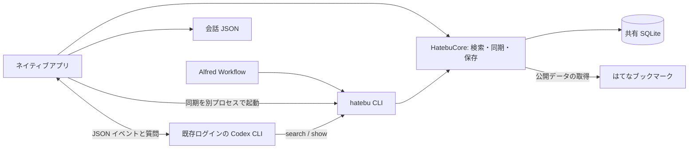

# Hatebu Search の設計

この文書は [要件](requirements.md)を実現するための構成、データ、処理、画面の状態をまとめる。
操作・インストールの手順は [README](../README.md)、実測値と未確認事項は [動作確認の記録](verification.md) に置く。

公開はてなブックマークを Mac に保存し、Alfred とネイティブアプリで同じ検索を使う。
通常検索はネットワークも AI も待たずに結果を表示する。
見つからないときだけ、候補を残したまま Codex と会話して探し直す。

## 全体構成

Swift Package に検索・同期・保存の共通ライブラリ `HatebuCore`、コマンド `hatebu`、SwiftUI アプリ `HatebuSearch` を置く。
macOS 14 以降を対象にする。
外部の言語実行環境を通常検索の必須条件にしない。
アプリと CLI は同じ SQLite データベースを開く。
Alfred Workflow には CLI を同梱し、アプリを起動せずに検索できるようにする。

アプリの通常検索は共通ライブラリを直接呼び、毎回 CLI を起動しない。
Alfred と Codex は同じライブラリを使う CLI を呼ぶ。
共有するのは同じ Mac の保存先であり、常駐サーバーを検索の前提にしない。

| 構成要素 | 責任 | 実装 |
| --- | --- | --- |
| 共通処理 | 検索条件、SQLite、はてなの取得、Alfred 出力、会話と Codex イベント | [HatebuCore](../Sources/HatebuCore/) |
| CLI | コマンド引数、共通処理の呼び出し、JSON / テキスト出力 | [CLI.swift](../Sources/HatebuCLI/CLI.swift) |
| アプリ | 検索の世代管理、画面の選択、会話の実行状態 | [SearchModel.swift](../Sources/HatebuApp/SearchModel.swift)、[SearchView.swift](../Sources/HatebuApp/SearchView.swift) |
| プロセス処理 | 検索と独立した同期、Codex とツールの停止 | [BackgroundSync.swift](../Sources/HatebuCore/BackgroundSync.swift)、[CBackground](../Sources/CBackground/) |
| 配布 | 共通バイナリ、バージョン、署名、アーカイブ、タグ公開 | [scripts](../scripts/)、[CI](../.github/workflows/ci.yml) |

Codex は既存の CLI を子プロセスとして起動する。
SwiftUI アプリから呼ぶため、TypeScript 実行環境を追加せず、`codex exec --json` の出力を読み取る。
会話は ID を保存し、`codex exec resume` で継続する。
これは公式が案内する JSON イベントとセッション再開を使う方式である。
[Codex 非対話実行](https://learn.chatgpt.com/docs/non-interactive-mode)

## 画面と操作

アプリは左から取り込み元と会話履歴、検索結果、AI との会話の三つの領域を持つ。
検索欄に入力すると、タイトル・URL・コメント・タグを対象に検索する。
候補にはタイトル、ドメイン、登録日、コメント、タグを表示する。
選んだ候補を開く・URL をコピーする・会話の参考候補にする操作を用意する。
一致した語はタイトル・コメント・タグ・ドメインの中で強調する。
検索と同じ正規化を使い、全角英数字や合成文字の一致位置を元の表示文字へ戻す。
新しい検索語・取り込み元・結果タブへ切り替えたときは選択を解除し、検索完了時に先頭行を自動選択しない。
AI の最終回答を表示したときと会話履歴を開いたときも未選択にする。
検索欄にカーソルを残したまま、未選択から ↓ で先頭、続く ↑↓ で前後の候補を選び、Enter で開く。
未選択なら Enter は何も開かない。選択行が表示範囲外へ移動したらスクロールする。
各行の右端には「開く」と外部ページを示す矢印のボタンを常に表示し、未選択でもクリックした行の記事をブラウザで開ける。
行の本文をクリックすると選択し、ダブルクリックすると開く。ボタンは行本文のダブルクリック処理の外に置く。
結果があるときは未選択でも下部の操作欄を残し、「↓ 先頭を選択」と案内する。下部の開く・コピーする操作は選択するまで無効にする。
同じ検索語の更新では、利用者が選んだ ID が結果に残る限り維持し、消えた場合は未選択にする。
入力欄は AppKit のフィールドエディタを使い、日本語変換中のキー操作は変換を優先する。
検索欄がウィンドウに加わったときに最初の入力先として登録し、ウィンドウが前面になったときとアプリへ戻ったときに検索欄へフォーカスする。
Dock から開き直した場合と Alfred から検索を引き継いだ場合も同じ入力先にする。設定画面の表示中や別ウィンドウが操作対象の場合はフォーカスを奪わない。
すでに検索欄で入力中ならカーソル位置と日本語変換を維持する。通常の結果更新ではフォーカスを変えない。
左上はサイドバー開閉ボタンにし、⌥⌘S でも切り替えられる。

結果のタイトルは 15 pt、コメントは 13 pt、日付とドメインは 12 pt、タグは 11 pt とする。
コメントは主本文の文字色、補足文字は主本文の文字色の 82% の濃さにし、小さく薄い文字が重なることを避ける。
緑色の文字・アイコンは明暗の画面で色を切り替える。白文字を載せるボタンの背景色とは分ける。
一致語は主本文の文字色にし、背景を黄色で強調する。選択中・未選択の両方で読みやすさを確認する。
文字の明暗差は [WCAG のコントラスト基準](https://www.w3.org/TR/WCAG22/#contrast-minimum)を目安にし、実画面での確認結果は検証記録へ残す。

会話欄には「覚えていることを入力…」という入力欄を置く。
送信時点の検索語と候補の ID を渡す。
Codex が共通 CLI で検索した候補を表示し、説明は会話欄に表示する。
実行中も通常検索と候補の操作を続けられる。
停止ボタン、失敗した理由、同じ会話への追加質問を用意する。

AI が返す候補は `bookmarkIDs` と説明の JSON にする。
タイトルと URL は、その ID をローカル DB で引いて表示する。
DB にない ID を採用せず、実在する保存済み候補を表示する。
記事本文の取得は今回の検索対象に含めない。

初回は取り込み元の追加画面を表示する。
はてなユーザー名を登録すると、公開ブックマークを取り込む。
Codex の実行ファイルは一般的なインストール先から探し、設定画面で変更できる。

## Alfred

`hb 検索語` で CLI の Alfred JSON 出力を表示する。
Enter で記事を開き、Command + Enter でその候補を参考にアプリで検索を続ける。
結果の末尾には、候補がゼロ件でも使える「アプリで続きを探す」を置く。
CLI が URL scheme を生成し、アプリは検索語と候補 ID を読み取る。
AI はアプリが開いただけでは実行せず、条件を入力して送信すると実行する。

Alfred の `alfred` コマンドはキャッシュを検索し、古い場合は別のプロセスグループで同期 CLI を起動する。
検索結果は同期を待たずに返す。Alfred が入力変更で前の検索プロセスを終了しても同期は続く。
同期中は JSON の `rerun` で同じ検索を再実行し、キャッシュ更新を反映する。
アプリで有効にした定期同期は、同梱 CLI を macOS の LaunchAgent から起動する。
同期の有効化・無効化は設定画面で操作できる。
アプリをインストールした場所を変更した場合は、設定画面から再設定する。
[Alfred Script Filter JSON](https://www.alfredapp.com/help/workflows/inputs/script-filter/json/)

受け渡しには `hatebusearch` URL scheme の `search` を使い、`q` に検索語、`id` に任意の候補 ID を入れる。
URL の生成と読み取りは `URLComponents` で行い、日本語や記号を文字列連結で壊さない。

## データと検索

既定の保存先は `~/Library/Application Support/HatebuSearch/`。
`HATEBU_DATA_DIR` と CLI の `--data-dir` で別の保存先も指定できる。
動作確認用のデータはこの切り替えで通常データと分ける。

| 保存するもの | 内容 |
| --- | --- |
| sources | はてなユーザー名、前回成功時刻、全件照合時刻、取得位置、直近のエラー |
| bookmarks | ID、取り込み元、URL、タイトル、コメント、タグ、登録日時、検索用文字列 |
| 会話 JSON | アプリが管理する会話 ID、Codex の会話 ID、検索語、候補 ID、会話の本文、実行状態と開始・終了時刻、ツールの履歴 |

`sources` と `bookmarks` は SQLite のテーブル、会話は同じ保存先の `conversations` ディレクトリに置く JSON ファイルとする。
会話ファイルは一度に置き換え、書きかけの JSON を履歴として読まないようにする。
ブックマークの ID はユーザー名と URL から決める。同じ URL を持つ別ユーザーのデータは別の ID になる。

SQLite の FTS5 trigram 索引で 3 文字以上の部分一致を絞り込み、短い語は文字列一致で補う。
検索文字列と検索語を同じ規則で正規化し、全角英数字と英字の大小の違いを吸収する。
複数語は AND 検索とし、`tag:`、`site:`、`after:`、`before:` に対応する。
SQL と FTS の検索構文はユーザー入力をそのまま組み立てず、値として渡す。
タイトルの一致を優先し、同程度なら登録日の新しい候補を先に表示する。
[SQLite FTS5](https://www.sqlite.org/fts5.html)

検索と詳細取得はデータベースを読み取り専用で開く。
検索からデータベース作成・移行・ネットワーク取得を呼ばない。
初回のデータがなければ、アプリで取り込み元を登録する案内を表示する。

### 入力と再検索

入力が変わると 35 ms 待って検索を開始し、処理中は前回の結果を保持する。
入力ごとに番号を更新し、完了した検索の番号が最新である場合だけ結果を反映する。
検索処理は画面の更新とは別のタスクで行う。キャンセルだけに頼らず、古い処理の完了を番号で除外する。

アプリは同期状態を 2 秒ごとに確認し、前回の更新成功時刻が変わったら現在の入力で再検索する。
Alfred は更新中に `rerun: 1.0` を返し、1 秒後の再実行で新しいデータを反映する。
これは保存済みの結果を先に使いながら更新する、stale-while-revalidate の動作に相当する。

| 条件 | 解釈 |
| --- | --- |
| 複数語・引用符 | 語は AND 条件。引用符内は一つのフレーズ |
| `tag:` | 正規化したタグの完全一致 |
| `site:` | 指定ドメインとそのサブドメイン |
| `after:` / `before:` | 登録日の範囲。開始を含み、終了を含まない。日付境界は UTC |

## 同期

同期開始時にプロセス間のロックを取り、同じ保存先への二重同期を抑止する。
ネットワーク取得と形式の検査を終えてから、データと索引を同時に更新する。
SQLite は WAL を使い、更新中も前回のデータを検索できるようにする。
ブックマーク更新と同期位置の保存は同じトランザクションで確定し、失敗時は前回のデータと取得位置を残す。
[SQLite WAL](https://www.sqlite.org/wal.html)

公開はてなブックマークは `search.data` を使う。
初回と定期的な全件照合では、`limit` と `offset` で続きのページまで取得する。
既定の応答だけで全件取得できたとは判断せず、続きのページを取得する。実データの件数は検証記録に置く。
1 ページは 5,000 件とし、ページの境界は 100 件重ねて重複を除く。途中ページの取得に失敗したら全体の更新を中止する。
それ以外は前回取得開始時刻より 120 秒前から差分を取得する。
同時刻の追加を取りこぼさないように重複を許し、URL 単位で置き換える。
全件照合時は削除も反映する。
形式が壊れた応答や HTTP エラーで保存済みデータを消さない。
古い `about:` などのブックマークも検索用には保持する。アプリと Alfred から開けるのは、ホストを持つ HTTP / HTTPS の URL に限る。
認証用 Cookie は送らず、公開データを対象にする。
[既存パーサーの形式説明](https://github.com/azu/hatebu-mydata-parser/blob/master/doc/search.data-format.md)

取り込み元単位でデータを管理し、別のユーザーの削除で巻き添えにしない。
asocial-bookmark は今回の対象に含めない。

| 更新の条件 | 処理 |
| --- | --- |
| 初回、前回の全件照合から 7 日経過、手動の全件更新 | 続きのページも含めて取得し、対象ユーザーの全件を置き換える |
| 前回の成功から 15 分経過 | 差分を取得する |
| 更新が失敗した直後 | 60 秒間は自動再試行を控え、前回の成功時刻と取得位置を進めない |
| 新しいキャッシュへの通常検索 | 取得を始めずに保存済みの結果を返す |

はてなの `search.data` の形式とページ継続に依存する。
差分取得だけでは過去の編集・削除が直ちに反映されず、ページ取得中の提供元の変更も完全な時点固定ではない。
ページの重なりと定期的な全件照合で補い、取得形式の異常や同じページの繰り返しは失敗として扱う。

## AI との対話と途中経過

一般的な AI の対話設計として、実行内容が見えること、利用者が制御できること、不確かさを示すことを採用する。
Microsoft の [UX design for agents](https://microsoft.design/articles/ux-design-for-agents/) と、Google PAIR の [Feedback + Control](https://pair.withgoogle.com/guidebook-v2/chapter/feedback-controls/) を参考にする。

| 状態 | 画面と操作 |
| --- | --- |
| 送信前 | 通常検索と参考候補を見ながら、覚えている内容を入力する。公開ブックマークのタイトル・コメントを Codex に渡す範囲を示す |
| 起動・実行中 | 起動中、手がかりの確認、ローカル検索などの現在の処理を短く表示する |
| 検索完了ごと | 実際の検索語と件数を履歴へ追加し、DB にある候補を一覧へ反映する。回答の完了を待たずに開く・コピー・参考にする操作ができる |
| 条件変更 | 入力欄を使い続けられる。「この条件で探し直す」は子プロセスの停止完了を待ってから同じ会話へ送信する |
| 停止・失敗 | 見つかった候補と検索履歴を保存する。失敗時は条件を編集して再試行、または新しい会話を選べる |
| 完了 | 絞られた候補と短い説明・追加質問を表示する。候補ゼロを通常検索の結果で置き換えない |

進捗率や残り時間は推測しない。会話欄の上部に「検索中」「検索完了 · N 件」「停止」「失敗」を固定して表示する。
処理の開始時刻から経過時間を表示し、完了後は実際に終わった時刻で止める。完了状態と候補数も保存する。
「使ったツール」で `hatebu search`、`hatebu show`、受信した MCP ツール名、検索語・件数・状態を確認できる。
実行コマンドは詳細を開いたときだけ表示する。
ツールの途中更新も読み取り、回答全体の完了と各操作の結果を別々に管理する。
終了通知のない操作は「結果未確認」と表示し、失敗だったとは判断しない。
実際に終了コードや失敗状態を受信した操作だけを「失敗」にする。
`command_execution` の開始・完了イベントと、検索 CLI の JSON に含まれる検索語・件数が履歴の根拠となる。
内部の思考過程は表示しない。記事本文を読んだかのような説明もしない。
ツールの種別・状態は [Codex のイベント型](https://github.com/openai/codex/blob/main/sdk/typescript/src/items.ts)に沿って解釈する。
会話・検索履歴・途中の候補はイベントの受信時にも保存し、停止後やアプリの再起動後に残す。
同じ Codex 会話で複数の実行を重ねないため、停止が完了するまで会話の切り替えと再送信を待つ。

## Codex の実行

会話を送信すると、検索語・表示中の候補・参考候補・検索 CLI の絶対パスをプロンプトへ渡す。
全件データを渡さず、Codex が `hatebu search` と `hatebu show` を使って追加の候補を探す。
読み取り専用の sandbox を指定し、プロンプトで `search` / `show` の利用と、ネットワーク検索・本文取得・同期・ファイル編集を行わないことを指示する。
検索回数は 8 回程度を目安として指示するが、回数を強制する仕組みではない。
ブックマークの文章は検索対象のデータであり、実行すべき指示として扱わない。

実行ファイルは起動のたびにシンボリックリンクを解決し、Codex の更新で固定された旧バージョンを呼び続けないようにする。
プロンプトは標準入力へ渡し、シェル文字列として実行しない。
標準出力の JSON を行単位で読み、途中で分割された UTF-8 や行をバッファーに保持する。
標準エラーは別に収集する。
終了・失敗・停止を区別し、停止後に古い結果で画面を上書きしない。

停止時は Codex とそこから起動したツールのプロセスグループへ終了を通知し、2 秒後も残っていれば強制終了する。
1 回の検索が 180 秒を超えた場合も停止し、条件を絞って続けられることを案内する。
全体の成功条件はプロセスの正常終了、`turn.completed`、構造化された最終回答の三つを受け取ることとする。
この条件を満たしていても、終了通知のない個別ツールは成功へ補完しない。

Codex の認証切れ・未インストールは会話欄に案内する。
通常検索はそのまま使える。
アプリからの実行では既存ログインを引き継ぎ、API キーは注入しない。個人の追加 MCP 設定が検索と無関係に起動しないよう `--ignore-user-config` を使う。
その際、既存 `config.toml` の `cli_auth_credentials_store` だけを引き継ぎ、Keychain 保存のログインも Codex 自身に読み取らせる。認証情報をアプリ側で読み取ったり複製したりしない。
会話の再開に `--last` は使わず、保存した ID を明示する。
Codex の会話が消えて再開できない場合は、新しい会話を開始する操作を案内する。

## 配布と確認

ビルドスクリプトで `.app` と `.alfredworkflow` を生成する。
共通の `Assets/AppIcon.png` から各サイズの画像を生成し、アプリの `CFBundleIconFile` に ICNS を設定する。Workflow には同じ画像の `icon.png` を含める。
CLI は両方に同梱し、共有保存先の規則とデータ形式を一致させる。
バージョンは `VERSION` に集約し、アプリ・Workflow と公開タグの番号を一致させる。
CI は Apple Silicon / Intel でテストし、両方を含むバイナリをビルドする。
アプリは実行権限を保った ZIP にまとめ、Workflow と SHA-256 の照合ファイルを添える。
PR・通常 push は成果物を作るところまで、`v` タグの push だけ GitHub Releases へ公開する。
公開ジョブだけが書き込み権限を持ち、そこでソースのビルドやテストを実行しない。
既存リリースを上書きせず、修正は新しいバージョンで配布する。

ローカルと CI のビルドは ad-hoc 署名とし、Developer ID 署名・公証はまだ行わない。
README に配置・初回起動・Workflow の追加をまとめる。
macOS に止められた場合の「このまま開く」と、対象アプリの隔離属性だけを削除する `xattr` の操作も案内する。
この作業ではユーザーの Applications や Alfred 設定へ自動インストールしない。

テストでは日本語と短い語、検索条件、更新・削除・失敗時の保持、同期の重複、Alfred の出力、Codex イベントの分割と会話 ID の保持を確認する。
実際にビルドした CLI で取り込みと検索を実行し、ネイティブアプリの画面も確認する。
実 Codex の実行が環境の制約で確認できない場合は、疑似イベントによる検証と実機未確認を分けて報告する。

## 要件と確認箇所

| 要件 | 主な実装 | 主な確認 |
| --- | --- | --- |
| R1–R6: 取り込み・検索・更新・共有 | `Database`、`Synchronizer`、`SearchModel` | [検索テスト](../Tests/HatebuCoreTests/SearchTests.swift)、[結合テスト](../Tests/HatebuCoreTests/IntegrationTests.swift)、実データ計測 |
| R7–R9: 選択・強調・読みやすさ・サイドバー | `SearchField`、`SearchView`、`SearchHighlight` | [アプリ処理のテスト](../Tests/HatebuAppTests/SearchModelTests.swift)、[表示データのテスト](../Tests/HatebuCoreTests/PresentationTests.swift)、実画面と日本語変換 |
| R10–R11: Alfred と受け渡し | `Alfred`、`Handoff`、`BackgroundSync` | 結合テスト、アプリを閉じた状態での Alfred 操作 |
| R12–R16: 会話・進捗・停止・保存 | `CodexRunner`、`CodexEventParser`、`ConversationStore`、`SearchModel` | [子プロセスのテスト](../Tests/HatebuCoreTests/RunnerTests.swift)、アプリ処理のテスト、実ログインでの会話 |
| R17–R19: 配布・CI・インストール | `scripts`、GitHub Actions、README | バージョン、両 CPU、同梱 CLI、署名、ZIP、チェックサム、初回導入 |

上の表は検証方法との対応を示す。実施済みかどうかは [動作確認の記録](verification.md)を参照する。
